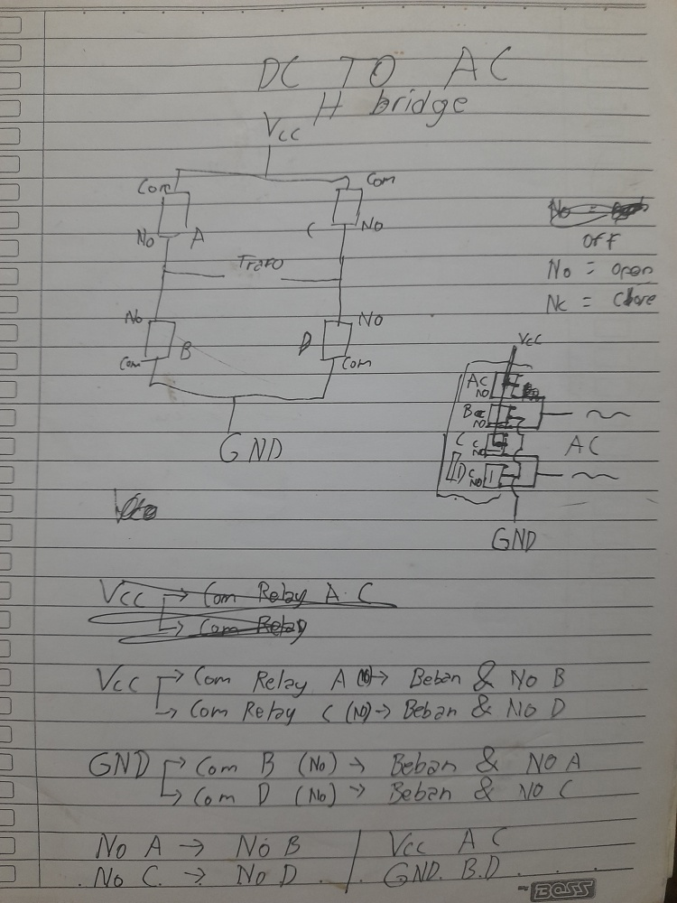

# ⚡ Mechanical H-Bridge Inverter — ESP8266 Based

> **Turning "What If?" into a High-Voltage Reality.**

<p align="center">
  
  
  
  
  
</p>

An experimental project exploring the boundaries of mechanical switching in power electronics. This project converts **12V DC → 520V AC** using a custom-coded H-Bridge made of **mechanical relays**, controlled by an ESP8266. Born out of pure *kegabutan* (leisure curiosity) — and it actually worked.

---

## 📖 Project Overview

Normally, inverters use **MOSFETs or IGBTs** for high-speed switching. In this experiment, I challenged that norm by using **4-Channel Mechanical Relays** to handle the entire H-Bridge switching logic.

The goal was simple: reach a standard **50 Hz** frequency using an old UPS Iron-Core Transformer. What came out was far more interesting than expected — including a **520V AC output** that nobody planned for.

---

## 🛠️ Technical Specifications

| Component | Detail |
| :--- | :--- |
| **Logic Controller** | ESP8266 (Isolated Power via USB) |
| **Switching Element** | 4-Channel Relay Module (Active Low) |
| **Input Source** | 12V DC (1A Transformer + Bridge Rectifier) |
| **Smoothing** | 2× 4700µF 35V Electrolytic Capacitors (Series) |
| **Output Transformer** | Iron-Core Transformer 650VA (Ex-UPS) |
| **Tested Load** | Consumer-grade LED Bulb |
| **Measured Output** | ~520V AC (Square Wave) |
| **Operating Frequency** | ~41.67 Hz |

---

## 📐 Schematic & Design Notes

> Hand-drawn schematics from initial planning phase.

<p align="center">
  
  <br/>
  <em>Figure 1 — Original circuit design sketch (pencil on paper, the real engineering flavor 📝)</em>
</p>

<!-- Kalau kamu punya lebih dari 1 foto coret-coretan, tambahin di bawah ini: -->
<!--
<p align="center">
  
  <br/>
  <em>Figure 2 — Additional wiring & timing diagram sketch</em>
</p>
-->

---

## 📐 Mathematical Analysis — Cycle Timing

Based on the code implementation, the switching frequency was calculated as follows:

| Phase | Duration |
| :--- | :--- |
| Phase A+D (ON) — Forward Polarity | 10 ms |
| Dead-Time (Safety Gap) | 2 ms |
| Phase B+C (ON) — Reverse Polarity | 10 ms |
| Dead-Time (Safety Gap) | 2 ms |
| **Total Period (T)** | **24 ms** |

$$f = \frac{1000 \text{ ms}}{24 \text{ ms}} \approx \boxed{41.67 \text{ Hz}}$$

> **Conclusion:** The system operates at **41.67 Hz**, limited by the mechanical travel time of the relay armatures — not the code. The relay's physical inertia is the true bottleneck.

---

## 💻 ESP8266 Control Logic

The code implements a **Dead-Time Protection** strategy. This ensures relay contacts fully detach before the opposite phase activates, preventing catastrophic shoot-through / short circuits.

```cpp
// Active LOW relay: LOW = ON, HIGH = OFF
// Relay Pin Assignment
// relayA & relayD = Phase 1 pair (Forward)
// relayB & relayC = Phase 2 pair (Reverse)

void loop() {

  // === Phase 1: Forward Polarity ===
  digitalWrite(relayA, LOW);   // ON
  digitalWrite(relayD, LOW);   // ON
  digitalWrite(relayB, HIGH);  // OFF
  digitalWrite(relayC, HIGH);  // OFF
  delay(10);                   // 10ms conduction

  // --- Dead-Time: Fully cut Phase 1 before Phase 2 fires ---
  digitalWrite(relayA, HIGH);  // OFF
  digitalWrite(relayD, HIGH);  // OFF
  delay(2);                    // 2ms mechanical gap

  // === Phase 2: Reverse Polarity ===
  digitalWrite(relayB, LOW);   // ON
  digitalWrite(relayC, LOW);   // ON
  delay(10);                   // 10ms conduction

  // --- Dead-Time: Fully cut Phase 2 before Phase 1 fires ---
  digitalWrite(relayB, HIGH);  // OFF
  digitalWrite(relayC, HIGH);  // OFF
  delay(2);                    // 2ms mechanical gap

}
```

> The `delay(2)` dead-time is critical. Without it, both relay pairs could momentarily be ON simultaneously, creating a direct short circuit across the DC supply.

---

## 🔬 Test Results & Technical Analysis

From direct hands-on testing, several fascinating technical phenomena were observed:

### 1. ⚡ High Voltage Output (520V AC)
Output voltage spiked far beyond the intended 220V. This is caused by the nature of a **pure Square Wave signal**. The extremely sharp current interruptions by mechanical relays trigger massive **Back-EMF** on the UPS transformer's primary winding. The iron-core transformer essentially acts as a voltage multiplier under these abrupt switching conditions.

### 2. 🌡️ Thermal Overload on Input Transformer
The 1A, 12V input transformer became dangerously hot within **under 1 minute**. The 650VA UPS transformer's primary winding demands a far higher **magnetizing (inrush) current** than 1A. This forced the small transformer into a **saturated** state — where magnetic flux can no longer increase, and all excess energy converts directly to heat.

### 3. 💡 Load Quality — LED Survived
Despite the 41Hz frequency and 520V output, the **LED bulb lit stably without flicker**. This demonstrates the robustness of modern LED drivers — the internal switching regulator successfully rectified and regulated the extreme AC input into a stable DC current for the LED chip.

### 4. 🔩 Mechanical Stability & Dead-Time Validation
The relay operation produced a rapid, clean *"trekk... trekk..."* clicking sound at ~41Hz. Crucially, **no arcing** was observed inside the relay contacts — validating that the **2ms Dead-Time logic works perfectly** to safely break current before polarity reversal.

---

## 📸 Project Documentation

<p align="center">
  <!-- Ganti path di bawah ini dengan foto alatmu yang sedang menyala -->
  
  <br/>
  <em>Figure 2 — The inverter in operation, powering an LED bulb</em>
</p>

### 🎥 Video Documentation

> []([https://youtube.com/your-link-here](https://youtube.com/shorts/hcQn-Tut7-g?feature=share))
>

---

## ⚠️ Safety Warning

> [!CAUTION]
> This project involves **520V AC** output. Working with voltages above 50V AC is potentially **lethal**. This project is strictly for educational documentation purposes. Do **not** attempt to replicate without proper electrical safety knowledge and equipment.

---

## ✅ Conclusion

This project proves that a **Mechanical H-Bridge Inverter is entirely feasible**. The topology is highly effective at driving large iron-core transformers to produce high-voltage AC output.

**However, it is NOT recommended for long-term use due to:**
- ⚙️ **Mechanical wear** — relay contacts degrade rapidly at 41Hz switching cycles
- 🌡️ **Thermal mismatch** — undersized input transformer runs into thermal saturation
- 📉 **Poor power quality** — Square Wave output is incompatible with most AC equipment

**The real takeaway?** Engineering doesn't always go as planned — and that's where the most interesting lessons live.

---

## 👨‍💻 Author

| | |
|:---|:---|
| **Nama** | Fahri Azzam Mandriva |
| **Kelas** | XI PPLG |
| **Sekolah** | SMK Negeri 1 Purwokerto |
| **Kategori** | Legacy / Experimental Project |

---

<p align="center">
  <sub>⚡ Built with curiosity, a soldering iron, and too much free time. — Fahri Azzam Mandriva</sub>
</p>
